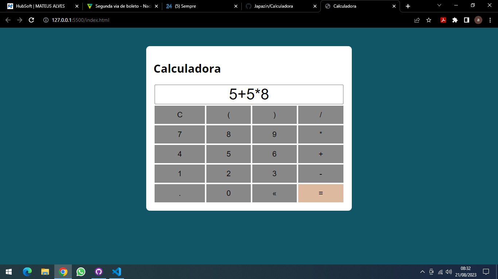

Utilizado HTML e CSS no Front-End e no Back-End Node.js
Utiliza-se a captura de clic e repassa ao imput e e calculado por (eval)
Caso digitge uma conta inválida será emitido uma mensagem de correção no Imput

